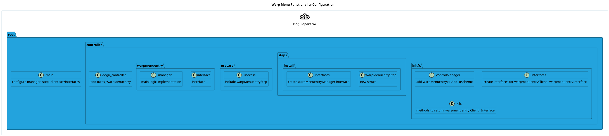
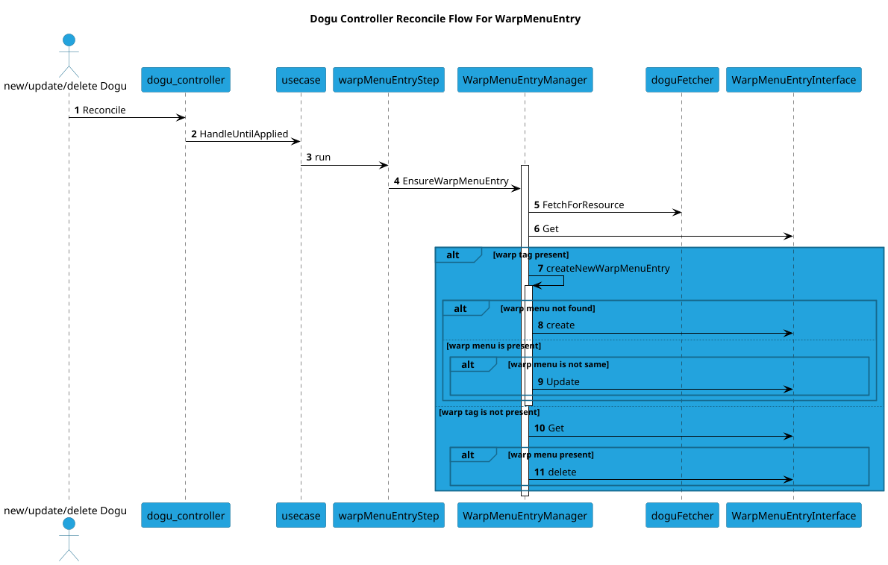

# WarpMenuEntries for v2 Dogus

This feature controls how the `k8s-dogu-operator` creates `WarpMenuEntry` custom resources for v2 Dogus.

## Behavior 

The operator creates/updates/deletes `WarpMenuEntry` CR with the same name as the Dogu(V2) during the regular reconciliation flow.

For a dogu to be visible in the warp menu, WarpMenuEntry CR should exist.

Earlier, k8s-ces-asserts (warpmenu) operator used to create the warp menu based on the dogu.json.
The k8s-ces-asserts (warpmenu) operator no longer creates the warp menu based on the dogu.json. Instead, we need to 
create/update/delete a `WarpMenuEntry` CR with the same name as the Dogu during the k8s-dogu-operator regular reconciliation flow.

Note that the warp menu entry will only be created if there is a warp tag in dogu.json.
Else, the reconcile process would ensure that there is no warp menu entry with the dogu name.
If a warp menu entry exists, but there is a change in the display name, category or path, the warpmenu entry will be updated during the reconciliation.

## Format of warp menu entry to be created

### For dogus that have a warp tag


If the dogu does have a warp tag (ex: jenkins dogu), there should be a warp menu entry created

 dogu.json:
```json
{
  "Name": "official/jenkins",
  "DisplayName": "Jenkins",
  "Category": "Development Apps",
  "Tags": [
    "warp"
  ],
```


This results in an `WarpMenuEntry` CR like:

```yaml
apiVersion: k8s.cloudogu.com/v1 # Replace with your CRD's group/version
kind: WarpMenuEntry # Replace with your CRD's Kind name
metadata:
  name: jenkins
  labels:
    app: ces
    app.kubernetes.io/name: k8s-warp-menu-entry-crd
spec:
  category: Development Apps
  disabled: false
  displayName:
    de: Jenkins
    en: Jenkins
  path: /Jenkins
```


### For dogus that do not have a warp tag

If the dogu does not have a warp tag (ex: ldap dogu), there will be no warp menu entry created:

dogu.json
```json
{
  "Name": "official/ldap",
  "DisplayName": "OpenLDAP",
  "Category": "Base",
  "Tags": [
    "authentication",
    "ldap",
    "users",
    "groups"
  ],
```

## Configuration and code flow

### Configuraiton
The dogu operator has to reconcile a few resources and hence has been broken down to multiple steps.
In order to summarize the list of all configurations/code changes that need to be done,
here is a diagram of the packages/files that need to be configured/created for the warp menu entry ) 



### Code Flow
Here is a pictorial depiction of the reconciliation flow for warp menu.
Note that we have only highlighted the part that reconciles the warpmenuentry.
The main.go file configures other steps during a dogu reconciliation process.




